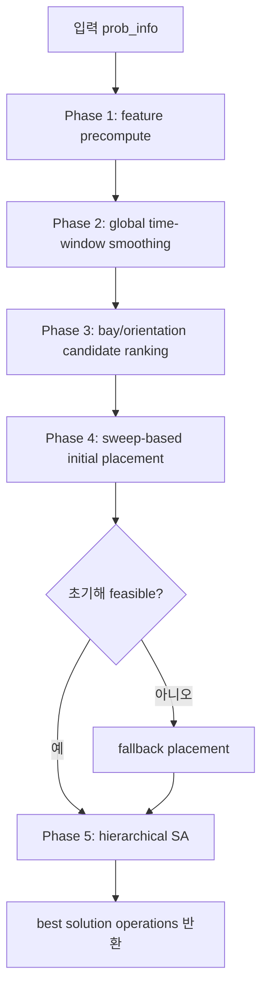

# Athena Solver 알고리즘 설명 자료

대상 독자: 자료구조, 알고리즘, 최적화 기초를 배운 공대 3학년  
코드 이름: **Athena Solver**  
핵심 아이디어: 먼저 빠른 휴리스틱으로 그럴듯한 배치를 만들고, 남은 시간 동안 Simulated Annealing으로 조금씩 개선한다.
코드 위치: public entrypoint는 `baseline/my_new_algorithm.py`이고, 실제 구현은 `baseline/athena/` 패키지에 phase별로 나뉘어 있다.

---

## 1. 문제를 한 문장으로 이해하기

조선소에는 여러 개의 bay가 있고, 각 block은 특정 시간에 들어와서 일정 기간 머문 뒤 나가야 한다. Solver는 각 block에 대해 다음 결정을 내려야 한다.

```text
(bay_id, x, y, orient_idx, entry_time, exit_time)
```

즉,

- 어느 bay에 둘지
- bay 안의 어느 좌표에 둘지
- 어떤 방향으로 회전해서 둘지
- 언제 넣고 언제 뺄지

를 정해야 한다.

그 결과는 feasibility checker가 검사한다. 주요 조건은 다음과 같다.

- release_time 이후에만 ENTRY 가능
- crane이 block을 넣고 뺄 때 다른 block에 막히면 안 됨
- 같은 시간에 같은 공간을 차지하면 안 됨
- bay 경계 밖으로 나가면 안 됨
- objective는 `w1*tardiness + w2*load_imbalance + w3*bay_preference_penalty`

Athena Solver는 이 문제를 exact solver처럼 완전히 수학적으로 풀지 않는다. 대신 제한 시간 안에 좋은 해를 빠르게 찾는 **휴리스틱 + 메타휴리스틱** 구조다.

---

## 2. 전체 Pipeline

코드의 `algorithm(prob_info, timelimit)`는 대략 아래 순서로 동작한다.



큰 방향은 이렇다.

1. block과 orientation별로 계산을 미리 해둔다.
2. block들이 시간축에서 너무 몰리지 않도록 target entry time을 정한다.
3. 각 block에 대해 어떤 bay와 orientation이 좋아 보이는지 점수를 매긴다.
4. target entry time 순서대로 block을 하나씩 실제 위치에 배치한다.
5. Simulated Annealing으로 entry time, bay, 위치, 방향을 바꿔 보며 objective를 줄인다.

### 코드 모듈 구조

`baseline/my_new_algorithm.py`는 contest contract를 지키기 위한 얇은 compatibility shim이다. 평가 도구는 계속 이 파일의 `algorithm(prob_info, timelimit)`를 import하지만, 내부 구현은 다음 모듈로 분리되어 있다.

- `baseline/athena/events.py`: structured event log
- `baseline/athena/features.py`: feature precompute, global time-window smoothing
- `baseline/athena/placement.py`: bay ranking, slot search, initial placement
- `baseline/athena/solution.py`: operations 변환, official feasibility 호출
- `baseline/athena/state.py`: incremental SA state, objective helpers
- `baseline/athena/fast_checks.py`: incremental feasibility filter와 pair/crane cache
- `baseline/athena/moves.py`: small/medium/large move 구현
- `baseline/athena/sa.py`: SA profile, temperature, acceptance, `sa_loop`
- `baseline/athena/parallel.py`: multi-start worker와 process orchestration
- `baseline/athena/entrypoint.py`: public `algorithm` 본체

---

## 3. Phase 1: Feature Precomputation

관련 코드:

- `Features`
- `precompute_features(prob_info, bays)`

### 왜 필요한가?

배치 알고리즘은 같은 질문을 반복해서 한다.

- 이 orientation의 가로/세로 크기는 얼마인가?
- 이 block이 이 bay에 들어갈 수 있는가?
- polygon의 면적은 얼마인가?
- boundary check를 빠르게 하려면 어떤 bounding box를 써야 하는가?

이걸 매번 Shapely로 계산하면 느리다. 그래서 block마다, orientation마다 필요한 값을 미리 계산해서 dict에 저장한다.

### 저장하는 값

`Features` 객체는 `(block_id, orient_idx)`를 key로 사용한다.

```text
F.aabb[(bi, oi)]       = axis-aligned bounding box
F.obb_local[(bi, oi)]  = oriented bounding box
F.local_polys[(bi, oi)] = layer별 polygon
F.n_layers[(bi, oi)]   = layer 개수
F.area_top[(bi, oi)]   = bottom footprint area
F.area_sum[(bi, oi)]   = 전체 layer area 합
F.crane_risk[(bi, oi)] = crane 충돌 위험 휴리스틱
F.dims[(bi, oi)]       = width, height
F.bay_fit[(bi, oi)]    = 들어갈 수 있는 bay 목록
```

현재 배치 단계에서 특히 많이 쓰는 값은 `aabb`, `dims`, `area_top`, `bay_fit`이다. `obb_local`과 `crane_risk`도 계산해 두지만, 현재 코드에서는 확장용 성격이 더 강하다.

### 직관

택배 상자를 창고에 넣는다고 생각하면, 매번 줄자로 재는 대신 상자별 크기표를 미리 만들어 두는 것이다.

---

## 4. Phase 2: Global Time-Window Smoothing

관련 코드:

- `smooth_time_windows(...)`

### 목표

각 block의 `target_entry`를 정한다. 여기서 target은 확정 시간이 아니라 "이쯤 넣으면 좋겠다"는 희망 시간이다.

단순히 모든 block을 release_time에 바로 넣으려고 하면 특정 시간대에 workload가 몰릴 수 있다. 그러면 load imbalance가 커지고, crane/공간 충돌 가능성도 커진다.

그래서 Athena는 시간축의 load를 보면서 block을 조금 분산시킨다.

### 처리 순서

block은 slack이 작은 순서로 처리한다.

```text
slack = due_date - release_time - processing_time
```

slack이 작다는 것은 여유 시간이 적다는 뜻이다. 이런 block을 먼저 좋은 시간대에 배치해야 tardiness를 줄일 가능성이 높다.

### 후보 entry time

각 block에 대해 다음 범위에서 후보 시간을 만든다.

```text
[release_time, due_date - processing_time]
```

후보가 너무 많으면 최대 `max_cands_per_block`개 정도로 샘플링한다. 그리고 혹시 feasible window가 너무 빡빡할 수 있으므로 `hi + 1`, `hi + 3`, `hi + 7` 같은 tardy 후보도 조금 추가한다.

### 비용 함수

후보 entry time `e`의 비용은 다음 세 항으로 계산한다.

```text
cost = alpha_peak * peak
     + beta_var  * variance_increment
     + gamma_tard * tardiness
```

의미는 다음과 같다.

- `peak`: 해당 block을 넣었을 때 시간대별 load의 최대값
- `variance_increment`: load 제곱합이 얼마나 늘어나는지
- `tardiness`: due_date를 넘기는 정도

즉, 시간축에서 일을 너무 한 곳에 몰지 않으면서도 납기를 넘기지 않도록 고른다.

### orientation 초기값

`target_orient`는 가장 "정사각형에 가까운" orientation을 고른다.

```text
ratio = max(width, height) / min(width, height)
```

ratio가 작을수록 길쭉하지 않다. 길쭉한 block은 배치가 까다로울 수 있으므로, 초기 추정에서는 비교적 균형 잡힌 orientation을 선호한다.

---

## 5. Phase 3: Bay Candidate Ranking

관련 코드:

- `rank_bays_for_block(...)`

### 목표

block 하나를 놓을 때 가능한 `(bay, orientation)` 후보를 점수 순으로 정렬한다.

점수는 대략 다음 요소를 본다.

```text
score = w3 * preference_penalty
      + w2 * load_imbalance
      + 1e-4 * area_room
```

### 항목별 의미

`preference_penalty`

block마다 bay 선호도가 있다. 가장 선호하는 bay와 비교해서 덜 선호하는 정도를 penalty로 둔다.

```text
preference_penalty = max_preference - preference[bay]
```

`load_imbalance`

해당 bay에 block workload를 추가했을 때 공식 obj2와 같은 area-weighted max-pairwise imbalance를 본다. 즉 SA와 최종 objective가 보는 `z2 = max |u_a * load_a - u_b * load_b|`와 같은 방향으로 초기 후보를 정렬한다.

`area_room`

bay 면적에서 block footprint area를 뺀 값이다. 현재는 아주 작은 weight `1e-4`만 붙어 있으므로 tie-breaker에 가깝다.

### 중요한 점

이 단계는 아직 실제 좌표를 정하지 않는다. "어떤 bay와 orientation부터 시도해 볼지" 순서를 정하는 단계다.
초기 placement에서는 기본 bay 후보 cap이 4여도 `max(4, n_bays)`개를 보며, orientation 중복 때문에 특정 bay가 잘리지 않도록 distinct bay를 우선 보존한다. 그래서 B5처럼 bay 수가 작은 benchmark에서는 가능한 bay가 후보 cap 밖으로 밀릴 위험을 줄인다.

---

## 6. Phase 4: Sweep-Based Initial Placement

관련 코드:

- `place_initial(...)`
- `_candidate_positions(...)`
- `_find_earliest_slot(...)`
- `_force_place(...)`
- `_placement_score(...)`

### Sweep 방식이란?

block을 어떤 순서로 쭉 훑으면서 하나씩 배치하는 방식이다. Athena는 다음 key로 정렬한다.

```text
(target_entry, due_date, -area)
```

즉,

1. target_entry가 빠른 block
2. due_date가 빠른 block
3. 면적이 큰 block

순서로 먼저 배치한다.

큰 block을 늦게 배치하면 남은 공간에 못 들어갈 가능성이 커진다. 그래서 tie-breaker로 큰 block을 먼저 둔다.

### 후보 위치 생성

`_candidate_positions`는 bottom-left fill 방식으로 후보 좌표를 만든다.

기본 후보는 다음과 같다.

- block의 AABB가 bay 안에 들어가도록 하는 가장 왼쪽/아래쪽 좌표
- 이미 놓인 block들의 오른쪽 끝
- 이미 놓인 block들의 위쪽 끝

이 아이디어는 2D packing에서 흔히 쓰는 방식이다. 모든 좌표를 다 뒤지지 않고, "새 block을 붙여 놓기 좋아 보이는 좌표"만 본다.

### 시간 slot 찾기

`_find_earliest_slot`은 특정 bay, 위치, orientation이 정해졌을 때 가능한 가장 이른 `(entry, exit)`를 찾는다.

검사하는 조건은 다음과 같다.

- ENTRY 시점에 crane entry가 가능한가?
- EXIT 시점에 crane exit가 가능한가?
- 중간 시간에 spatial collision이 생기지 않는가?
- 새 block 때문에 기존 block의 미래 EXIT가 막히지 않는가?
- 새 block 때문에 기존 block의 미래 ENTRY가 막히지 않는가?

특히 마지막 future ENTRY check는 dense instance에서 Stage 2 실패가 새는 것을 막기 위한 보강이다.

### 두 번 시도한다

`place_initial`은 block 하나를 배치할 때 두 번의 pass를 한다.

1. `target_entry` 이후로 배치 시도
2. 실패하면 `release_time` 이후로 완화해서 배치 시도

그래도 실패하면 `_force_place`를 쓴다.

### Force Place

`_force_place`는 안전장치다. 선호도가 높은 bay부터 보면서 block이 들어갈 수 있는 orientation을 찾고, 그 bay가 비어 있는 시간 window에 넣는다.

이 방법은 objective는 나빠질 수 있지만, feasible solution을 만들 가능성을 높인다.

### 배치 점수

후보 하나의 점수는 다음 요소를 합친다.

```text
placement_score = w1 * tardiness
                + w2 * load_imbalance
                + w3 * preference_penalty
                + 1e-4 * top_y
```

`top_y`는 block을 너무 위쪽에 쌓는 것을 약하게 피하게 하는 tie-breaker다.

---

## 7. Solution Format 변환

관련 코드:

- `assignments_to_solution(...)`
- `evaluate_solution(...)`

내부적으로는 block마다 assignment dict를 들고 있다.

```text
assignments[block_id] = {
    bay_id, x, y, orient_idx, entry_time, exit_time
}
```

하지만 checker가 요구하는 출력은 time string을 key로 하는 `operations` dict다.

```json
{
  "operations": {
    "10": [
      {"type": "EXIT", "block_id": 3, "bay_id": 1},
      {"type": "ENTRY", "block_id": 7, "bay_id": 0, "x": 4, "y": 2, "orient_idx": 1}
    ]
  }
}
```

같은 timepoint에서는 EXIT를 ENTRY보다 먼저 둔다. 이 순서가 중요하다. 같은 시각에 어떤 block이 나가고 다른 block이 들어오는 경우, 먼저 나간다고 처리해야 공간과 crane 조건을 만족할 수 있기 때문이다.

`evaluate_solution`은 변환된 solution을 `utils.check_feasibility`에 넣어서 feasible 여부와 objective를 얻는다.

---

## 8. Phase 5: Hierarchical Simulated Annealing

관련 코드:

- `sa_loop(...)`
- `_apply_small_move(...)`
- `_apply_medium_move(...)`
- `_apply_large_move(...)`

### Simulated Annealing이 왜 필요한가?

초기 placement는 greedy하다. 한 번 앞에서 잘못 놓은 block 때문에 뒤쪽 block들이 나빠질 수 있다. 이를 개선하기 위해 solution을 조금씩 흔들어 본다.

Simulated Annealing, 줄여서 SA는 다음 특징을 가진다.

- 더 좋은 해는 거의 항상 받아들인다.
- 더 나쁜 해도 초반에는 가끔 받아들인다.
- 시간이 지날수록 나쁜 해를 덜 받아들인다.

이렇게 하면 local optimum에 갇히는 것을 줄일 수 있다.

### Move 종류

Athena는 move를 세 크기로 나눈다.

#### Small move

확률 약 55%로 선택된다.

- entry time을 조금 앞뒤로 이동
- orientation을 변경하고 위치를 기본 corner로 snap

작은 변화라서 빠르게 많이 시도할 수 있다.

#### Medium move

확률 약 33%로 선택된다.

- 다른 bay로 이동
- x, y 위치를 조금 perturb

bay load imbalance나 preference penalty를 줄이는 데 도움이 될 수 있다.

#### Large move

작은 instance의 balanced profile에서는 12%로 선택되고, 큰 instance에서는
`_adaptive_move_probs`에 따라 더 자주 선택된다.

- tardiness가 큰 block을 우선 seed로 고른다.
- seed와 같은 bay의 시간상 가까운 이웃 block도 일부 함께 제거한다.
- 남은 block으로 bay 상태를 다시 만든다.
- 제거한 block을 slack, due date, 기존 tardiness 기준으로 다시 sweep-repair한다.

large move는 구조적으로 꼬인 배치를 풀기 위한 destroy-and-repair 방식이다. tardy
block만 빼서 다시 넣으면 이미 같은 bay 앞쪽에 고정된 block 때문에 더 이른 slot이
열리지 않는 경우가 많다. 그래서 큰 instance에서는 temporal neighborhood를 함께
destroy해서 bay 내부 순서가 실제로 바뀔 여지를 만든다.

### Accept rule

현재 objective가 `curr_obj`, 새 objective가 `obj`라고 하자.

- `obj < curr_obj`이면 accept
- infeasible이면 reject
- 더 나쁜 feasible 해라면 다음 확률로 accept

```text
P(accept) = exp(-(obj - curr_obj) / T)
```

여기서 `T`는 temperature다. 코드에서는 처음 `T = 100.0`이고 매 iteration마다 `T *= 0.97`로 줄어든다. `T < 0.01`이 되면 다시 `100.0`으로 reheat한다.

### Feasibility 검증 방식

중요한 점은 SA move가 직접 모든 constraint를 고치지는 않는다는 것이다. 예를 들어 small move로 entry time을 바꾸면 crane 충돌이 생길 수 있다.

그래서 각 candidate solution은 반드시 `check_feasibility`로 검증된다.

- feasible이면 objective 계산
- infeasible이면 objective를 `inf`로 취급
- reject되면 snapshot으로 되돌림

이 구조 덕분에 move 구현은 단순하게 유지하고, 최종 정합성은 공식 checker에 맡긴다.

### 병렬 multi-start SA

관련 코드:

- `parallel_sa_multi_start(...)`
- `_sa_worker(...)`
- `SA_PROFILES`

대회 서버는 최대 4 CPU core(400% CPU)를 허용한다. 초기해는 main process에서 한
번만 만들고, 남은 시간 동안 그 초기해를 deepcopy한 뒤 서로 다른 SA worker를
**최대 4개 병렬 실행**한다. worker 수는 `min(4, os.cpu_count() or 1)`로 제한하므로
4개를 넘지 않는다.

각 worker는 같은 초기해에서 출발하지만 다음을 다르게 가진다 (`SA_PROFILES`).

| profile | small / medium / large | bay-change 비중 | cooling | T0 scale |
| --- | --- | --- | --- | --- |
| balanced | 55 / 33 / 12 | 0.50 | 0.998 | 1.0 |
| large_repair | 40 / 25 / 35 | 0.50 | 0.997 | 1.3 |
| bay_reassign | 35 / 50 / 15 | 0.75 | 0.998 | 1.0 |
| local_position | 70 / 20 / 10 | 0.25 | 0.999 | 0.7 |

위 표는 작은 instance에서의 기본 비율이다. `n_blocks >= 120`인 큰 instance에서는
`sa_loop`가 `_adaptive_move_probs`로 effective move 비율을 조정한다. 목적은
작은/중간 move만으로 풀기 어려운 같은 bay 시간 혼잡을 destroy-repair 성격의
large move가 더 자주 건드리게 하는 것이다.

큰 instance에서의 effective large 비중:

| 조건 | balanced | large_repair | bay_reassign | local_position |
| --- | ---: | ---: | ---: | ---: |
| `120 <= n_blocks < 180` | 28% | 45% | 28% | 18% |
| `n_blocks >= 180` | 32% | 50% | 32% | 22% |

profile 0(balanced)은 작은 instance에서는 기존 단일 SA와 동일한 move 비율이므로,
worker 1개로 작은 benchmark를 돌리면 예전과 같은 동작이 된다. 각 worker는 random
seed도 서로 다르다. 실제 적용된 move cutoffs는 `sa.temperature.init` event의
`move_probs`에 기록된다.

구현상 주의점:

- process 기반 병렬화(`ProcessPoolExecutor`)를 쓴다. thread는 GIL 때문에 SA
  연산이 직렬화되므로 부적합하다.
- Shapely `Polygon`이 들어간 `Features`는 pickle이 까다로워 worker로 보내지
  않는다. 대신 각 worker가 `prob_info`로부터 bay와 feature를 **다시 계산**한다
  (benchmark 크기 기준 feature 재계산은 0.1초 미만이라 무시 가능).
- worker 함수는 top-level로 정의한다 (nested function은 pickle 불가). POSIX에서는
  `fork`, 그 외에는 `spawn` context를 쓴다.
- 모든 worker는 공통 `worker_deadline`에서 SA loop을 멈추고, main process는
  `gather_deadline`(< hard deadline) 안에서만 결과를 수집한다. 그래서 전체
  `timelimit`을 넘지 않는다.
- worker가 죽거나 timeout이 나도, pool 생성 자체가 실패해도 예외를 삼키고
  단일 SA 또는 초기해로 fallback한다. main process는 선택한 worker 결과를
  `check_feasibility`로 다시 검증한 뒤에만 채택한다.
- event log가 켜져 있으면 worker마다 `...worker0`, `...worker1` 식으로 별도
  파일에 기록해 로그 충돌을 막는다.

main process는 모든 worker 결과 중 **feasible이면서 objective가 가장 낮은**
solution을 고른다.

---

## 9. Fallback 구조

초기 배치가 실패할 수 있으므로 `algorithm`에는 여러 안전장치가 있다.

1. 기본 `target_entry`로 `place_initial`
2. 실패하면 `target_entry = release_time`으로 다시 `place_initial`
3. 그래도 실패하면 모든 block을 `_force_place` 방식으로 배치
4. 이후 SA 수행
5. SA가 feasible solution을 못 찾았지만 initial solution이 feasible이면 initial solution 반환

즉, 목표는 "무조건 멋진 최적화"가 아니라 "제한 시간 안에 feasible solution을 확보하고, 가능하면 개선"이다.

---

## 10. 시간 예산 관리

관련 코드:

- `hard_deadline`
- `safety`
- `init_deadline`
- `sa_deadline`

`timelimit`이 들어오면 전체 hard deadline을 잡고, 약간의 safety margin을 둔다.

```text
safety = min(0.5, max(0.05, timelimit * 0.02))
```

초기 배치는 전체 시간의 약 30% 근처에서 끝내려고 하고, SA는 약 92% 지점까지 사용한다. 마지막에는 solution 변환과 로그 종료를 할 시간이 필요하기 때문이다.

---

## 11. Event Log

관련 코드:

- `_init_event_log`
- `_emit`
- `_close_event_log`

환경 변수 `OGC2026_EVENT_LOG`가 설정되어 있으면 JSONL 형태로 진행 상황을 기록한다.

예시 event:

```text
algo.start
athena.features.done
athena.smoothing.done
athena.init.done
athena.init.fallback
athena.init.all_forced
sa.improvement
sa.complete
algo.end
```

이 로그는 benchmark에서 어느 phase가 병목인지, SA가 실제로 improvement를 만들고 있는지 분석하는 데 유용하다.

---

## 12. 간단한 의사코드

```text
function algorithm(prob_info, timelimit):
    deadline 설정
    bays, blocks, weights 읽기

    F = precompute_features(blocks, bays)

    target_entry, target_orient = smooth_time_windows(blocks, F)

    assignments = place_initial(
        target_entry,
        target_orient,
        bay ranking,
        position candidates,
        earliest feasible slots
    )

    if assignments infeasible:
        target_entry = release_time으로 바꾸고 다시 place_initial

    if still infeasible:
        all-forced placement 수행

    best = simulated_annealing(assignments)

    return assignments_to_solution(best)
```

---

## 13. 이 알고리즘의 장점

### 1. 빠른 초기해 생성

전체 탐색 공간은 엄청 크지만, Athena는 후보 bay, 후보 orientation, 후보 좌표를 제한해서 빠르게 초기 solution을 만든다.

### 2. 시간축 load를 먼저 평탄화

공간 배치만 보는 것이 아니라, 시간축 workload도 먼저 분산하려고 한다. 이게 `load_imbalance` objective에 직접적으로 도움이 된다.

### 3. Feasibility checker 중심 설계

SA에서 candidate를 만든 뒤 항상 `check_feasibility`로 검증한다. 이 덕분에 최종 solution contract를 어기지 않도록 방어할 수 있다.

### 4. Small/Medium/Large move 조합

작은 local search와 큰 destroy-repair를 같이 쓰기 때문에, 미세 조정과 구조적 탈출을 모두 시도한다.

### 5. 기존 baseline_greedy monkey-patch에 의존하지 않음

`baseline_greedy.py`를 재사용하지 않고, 자체 `_find_earliest_slot`을 가진다. 따라서 다른 solver의 patch 상태에 덜 민감하다.

---

## 14. 한계와 개선 포인트

### 1. OBB와 crane_risk를 계산하지만 충분히 활용하지 않음

현재 `precompute_features`는 `obb_local`, `crane_risk`를 만들지만 초기 placement의 핵심 scoring에는 강하게 들어가지 않는다. 향후 후보 pruning이나 collision risk scoring에 사용할 수 있다.

### 2. 후보 좌표 수가 제한적

`_candidate_positions`는 bottom-left fill 후보만 본다. 빠르지만 좋은 위치를 놓칠 수 있다. dense geometry에서는 후보 다양성을 늘리는 것이 도움이 될 수 있다.

### 3. Small/Medium move는 repair 없이 바로 검증

entry time이나 위치를 조금 바꾼 뒤 infeasible이 되면 그냥 reject한다. 더 똑똑한 local repair를 붙이면 accept 가능한 후보가 늘어날 수 있다.

### 4. Force placement는 objective가 나빠질 수 있음

feasible solution 확보에는 좋지만, empty-bay window를 찾는 방식이라 tardiness가 커질 수 있다.

### 5. SA 평가 비용이 큼

매 iteration마다 전체 `check_feasibility`를 수행한다. block 수가 많으면 iteration 수가 제한된다. incremental feasibility check가 있으면 더 빨라질 수 있다.

---

## 15. 코드 읽는 순서 추천

처음 읽을 때는 위에서부터 전부 읽기보다 다음 순서가 좋다.

1. `algorithm`
2. `precompute_features`
3. `smooth_time_windows`
4. `place_initial`
5. `_find_earliest_slot`
6. `assignments_to_solution`
7. `sa_loop`
8. `_apply_small_move`, `_apply_medium_move`, `_apply_large_move`

이 순서로 보면 전체 흐름을 먼저 잡고, 그 다음 세부 휴리스틱을 이해할 수 있다.

---

## 16. 발표용 1분 요약

Athena Solver는 `baseline/my_new_algorithm.py` entrypoint와 `baseline/athena/` 내부 모듈로 구성되며, block stowage scheduling 문제를 다섯 단계로 푸는 휴리스틱 알고리즘이다. 먼저 block과 orientation별 bounding box, 면적, bay fit 같은 feature를 미리 계산한다. 그 다음 시간축 workload가 한쪽에 몰리지 않도록 각 block의 target entry time을 정한다. 이후 bay preference, workload balance, bay fit을 기준으로 후보 bay와 orientation을 정렬하고, target entry 순서대로 block을 하나씩 sweep 배치한다. 이때 crane entry/exit, spatial collision, future entry/exit blocking을 검사해서 가능한 가장 이른 slot을 찾는다. 초기해가 실패하면 release_time 기반 fallback과 force placement로 feasible solution을 확보한다. 마지막으로 Simulated Annealing을 돌면서 entry time, orientation, bay, position을 바꾸거나 tardy block을 destroy-repair하여 objective를 개선한다. 모든 후보는 `check_feasibility`로 검증되므로 최종 출력 형식을 안정적으로 만족하도록 설계되어 있다.
